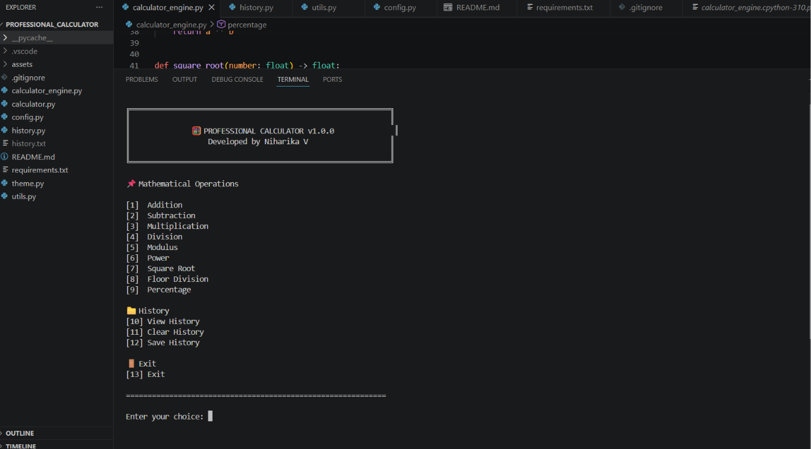
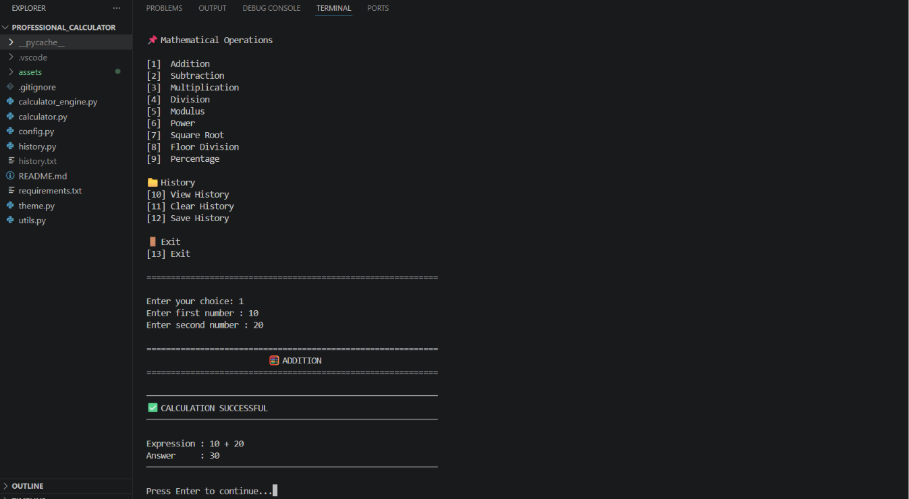
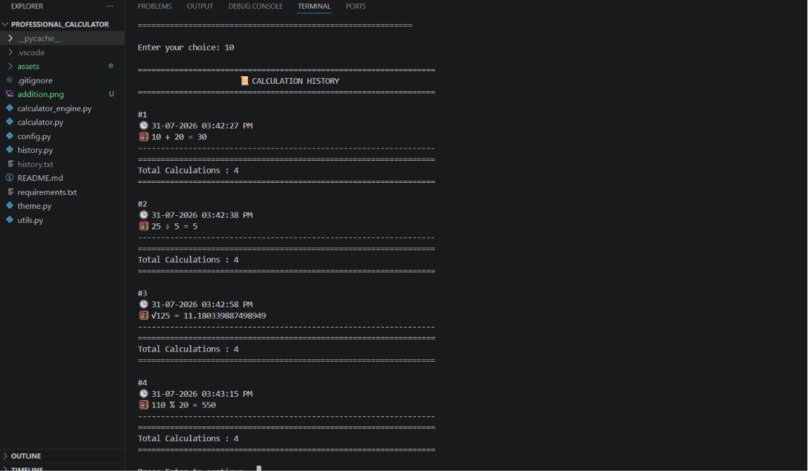
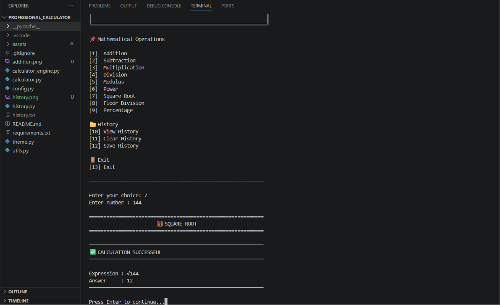

# 🧮 Professional Calculator

A professional command-line calculator developed in Python using a modular architecture. This project performs common mathematical operations, maintains calculation history with timestamps, and demonstrates clean coding practices suitable for academic projects and internship portfolios.

---

## 📌 Features

- ➕ Addition
- ➖ Subtraction
- ✖️ Multiplication
- ➗ Division
- 🧮 Modulus
- 🔢 Power
- √ Square Root
- 📊 Percentage
- 📂 Floor Division
- 📜 View Calculation History
- 🗑️ Clear History
- 💾 Save History to File
- 🕒 Timestamp for Every Calculation
- ⚠️ Exception Handling
- 🏗️ Modular Project Structure

---

## 📸 Project Screenshots

### 🏠 Home Screen



---

### ➕ Addition



---

### 📜 History



---

### √ Square Root



---

## 📂 Project Structure

```text
Professional_Calculator/
│
├── assets/
│   ├── home.png
│   ├── addition.png
│   ├── history.png
│   └── square_root.png
│
├── calculator.py
├── calculator_engine.py
├── config.py
├── history.py
├── utils.py
├── theme.py
├── README.md
├── requirements.txt
└── .gitignore
```

---

## 🚀 Technologies Used

- Python 3
- VS Code
- Git
- GitHub

---

## ▶️ How to Run

### Clone the repository

```bash
git clone https://github.com/niharika8050-sys/Professional-Calculator.git
```

### Move into the project folder

```bash
cd Professional-Calculator
```

### Run the calculator

```bash
python calculator.py
```

---

## 💡 Concepts Used

- Functions
- Modular Programming
- Dictionaries
- Exception Handling
- File Handling
- Lists
- Loops
- Conditional Statements

---

## 🔮 Future Enhancements

- Scientific Calculator
- GUI using Tkinter
- Dark Theme
- Export History to CSV
- Calculation Statistics

---

## 👩‍💻 Author

**Niharika V**

B.E. Artificial Intelligence & Machine Learning

Python Developer

GitHub: https://github.com/niharika8050-sys

---

⭐ If you found this project useful, consider giving it a Star.